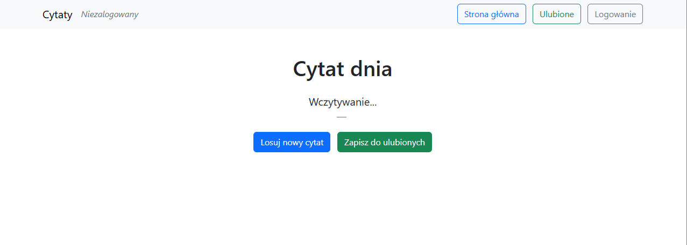
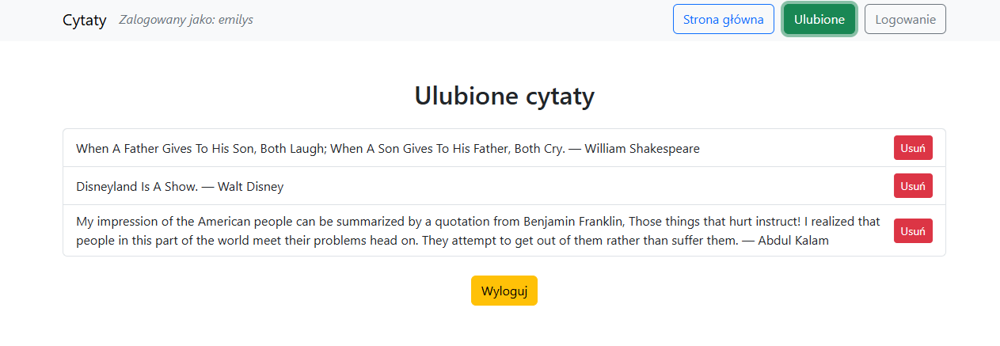

# PWA-Quotes

Progresywna aplikacja webowa (PWA) do wyświetlania losowych cytatów.  (projekt zaliczeniowy na przedmiot "Multiplatformowe aplikacje w języku JavaScript"

- Pobieranie cytatów z publicznego API (`https://dummyjson.com/quotes/random`).
- Logowanie użytkownika (przez API DummyJSON).
- Zapisywanie ulubionych cytatów dla zalogowanego użytkownika.
- Przechowywanie stanu aplikacji i cytatów w trybie offline.
- Nawigację między trzema widokami: Strona główna, Ulubione, Logowanie.

Aplikacja jest zgodna z wymaganiami PWA i działa w przeglądarkach opartych na Chromium (Chrome, Edge).

---

## Zrzuty ekranu

### Strona główna (pierwsze uruchomienie)


### Strona główna


### Logowanie


### Strona główna (zalogowany)


### Ulubione cytaty


---

## Funkcjonalności

1. **Strona główna**  
   - Wyświetla losowy cytat dnia.
   - Możliwość losowania nowego cytatu.
   - Możliwość dodania cytatu do ulubionych (tylko dla zalogowanych użytkowników).

2. **Logowanie**  
   - Obsługuje logowanie i wylogowywanie.
   - Stan zalogowania jest przechowywany w `localStorage`.
   - Po zalogowaniu użytkownik może zobaczyć i zapisać ulubione cytaty.

3. **Ulubione**  
   - Wyświetla listę cytatów zapisanych przez zalogowanego użytkownika.
   - Możliwość usuwania cytatów z ulubionych.

4. **Offline Mode**  
   - Cytaty są buforowane w cache (Service Worker) i mogą być wyświetlane bez połączenia z Internetem.
   - Pierwsze uruchomienie wymaga sieci, kolejne działają offline z zapisanych danych.

---

## Technologie

- **Frontend:** HTML, CSS, JavaScript (ES Modules), Bootstrap 5  
- **PWA:** Vite + `vite-plugin-pwa`  
- **API:** DummyJSON (`https://dummyjson.com/quotes/random`, `https://dummyjson.com/auth/login`)  
- **Przechowywanie stanu:** `localStorage` + Cache API

---

## Struktura projektu
```
pwa-quotes/
│
├─ public/
│   ├─ icon.png
│   └─ manifest.json
│
├─ src/
│   ├─ main.js          # Punkt wejścia aplikacji
│   ├─ auth.js          # Obsługa logowania i wylogowania
│   ├─ favorites.js     # Obsługa ulubionych cytatów
│   ├─ quotes.js        # Pobieranie i cache cytatów
│   └─ views.js         # Nawigacja między widokami
│
├─ index.html
├─ package.json
├─ vite.config.js
└─ README.md
```

# Wymagania projektu

Zadania mogą być wykonane z wykorzystaniem biblioteki Electron.js lub w postaci aplikacji PWA. Aplikacja Electron.js ma działać w systemie operacyjnym Windows/Linux lub macOS, a aplikacja PWA ma poprawnie działać w przeglądarce internetowej Chrome (lub dowolnej innej opartej na silniku Chromium). W ramach zadania wykorzystać można dowolne biblioteki i frameworki zgodne z wykorzystaną technologią. Zachęcam również do korzystania z bibliotek do budowy UI, które znacznie przyspieszą pracę nad projektem.

- wykorzystanie dowolnego API, które dostępnie jest publicznie (otwartego lub dostępnego po zalogowaniu się celem uzyskania odpowiedniego klucza) - z aplikacji ma być wysyłane zapytanie do API, ma być odpowiednio interpretowane, a jego wynik ma być wyświetlany użytkownikowi

- przechowywanie stanu aplikacji pomiędzy ponownymi uruchomieniami - może być zrealizowane w postaci odpowiedniej implementacji cache'a

- implementacja nawigacji pomiędzy minimum trzema różnymi widokami aplikacji (przełączanie stron lub okien aplikacji)

- w aplikacji ma znajdować się przynajmniej jeden skrypt w języku JavaScript, który wykonywany będzie po stronie urządzenia klienckiego i ma on operować na danych wprowadzonych przez użytkownika (np. ma wykorzystywać lokalizację urządzenia, obsługiwać kontrolkę, której wartość ustala użytkownik itp.)

- implementacja logowania do aplikacji - można wykorzystać w tym celu API (np. DummyJSON - Auth) - logowanie ma dawać dostęp do jakiegoś zasobu, który nie jest widoczny przed logowaniem; stan logowania powinien być przechowywany pomiędzy uruchomieniami aplikacji

UWAGA! Zaimplementowana aplikacja ma działać poprawnie w trybie off-line. Pierwsze uruchomienie może korzystać z sieci, ale drugie i każde kolejne ma w przypadku braku dostępu do Internetu korzystać z danych zapisanych przez aplikację.


## Uwagi

Aplikacja działa poprawnie offline dzięki Service Worker i Cache API.

Logowanie korzysta z API DummyJSON – dla testów można użyć przykładowych kont z dokumentacji DummyJSON.

Cytaty są buforowane i zapisywane indywidualnie dla każdego użytkownika w localStorage.

# Autor
 Michał Gołaszewski

 # Licencja
MIT License